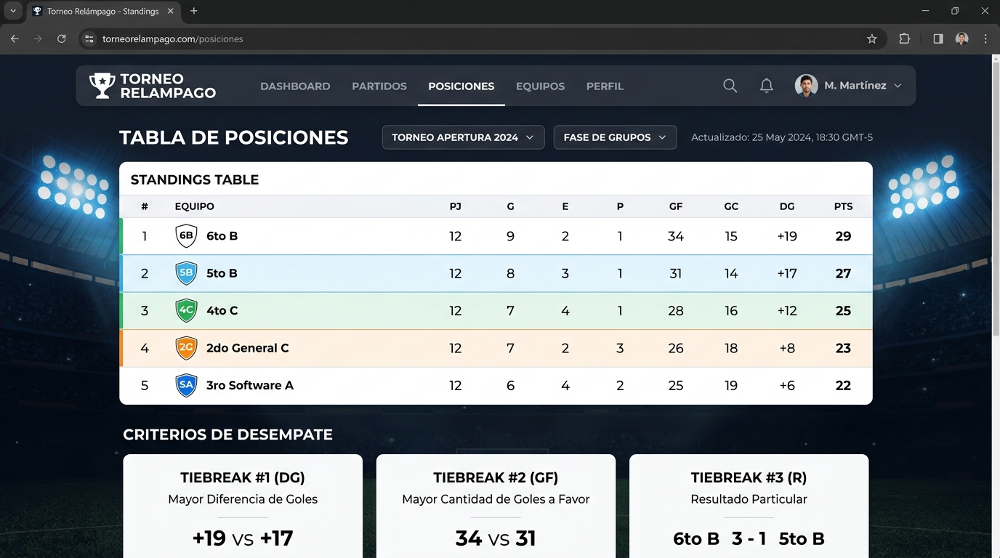

# Prompt 1: Torneo Relámpago - Organizador Estudiantil

Esta carpeta contiene la evidencia y captura de pantalla correspondiente al **Prompt 1**.

## 📸 Captura de Pantalla - Prompt 1

### 📋 Descripción de la Evidencia (Prompt 1)
En la imagen se observa la aplicación **TORNEO RELÁMPAGO** en ejecución dentro de AI Studio:
- **Encabezado:** "TORNEO RELÁMPAGO [RECREO] - Organizador estudiantil de fútbol escolar sin papeles perdidos", mostrando **6 equipos** y **6 partidos programados** con guardado automático en celular.
- **Tabla de Posiciones en Tiempo Real:**
  - **2° puesto:** `6to B - La Máquina` (5 pts, PJ 3, PG 1, PE 2, PP 0, GF 2, GC 0, DG +2). Indica: *"Debajo de 5to A - Los Rayos por Goles a Favor (2 vs 3)"*.
  - **3° puesto:** `5to B - Galácticos` (2 pts, PJ 3, PG 0, PE 2, PP 1, GF 1, GC 3, DG -2). Indica: *"Supera a 4to C - Furia FC por Goles a Favor (1 vs 0)"*.
  - **4° puesto:** `4to C - Furia FC` (2 pts, PJ 3, PG 0, PE 2, PP 1, GF 0, GC 2, DG -2). Indica: *"Debajo de 5to B - Galácticos por Goles a Favor (0 vs 1)"*.
  - **5° puesto:** `2do General C` (0 pts, PJ 0, PG 0, PE 0, PP 0, GF 0, GC 0, DG 0).
  - **6° puesto:** `3ro Software A` (0 pts, PJ 0, PG 0, PE 0, PP 0, GF 0, GC 0, DG 0). Indica: *"Empate total en criterios con 2do General C (orden alfabético / sorteo)"*.
- **Desempates de Posición Resueltos (3):**
  - **#1:** 5to A - Los Rayos supera a 6to B - La Máquina con 5 pts por mayor cantidad de Goles a Favor (3 vs 2).
  - **#2:** 5to B - Galácticos supera a 4to C - Furia FC con 2 pts por mayor cantidad de Goles a Favor (1 vs 0).
  - **#3:** 2do General C y 3ro Software A están empatados en todos los criterios deportivos (0 pts, DG 0, GF 0).

---
*Archivo generado para evidencia y seguimiento de versiones del proyecto.*
