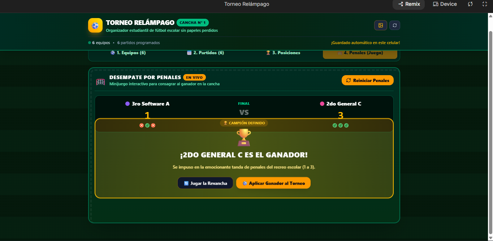
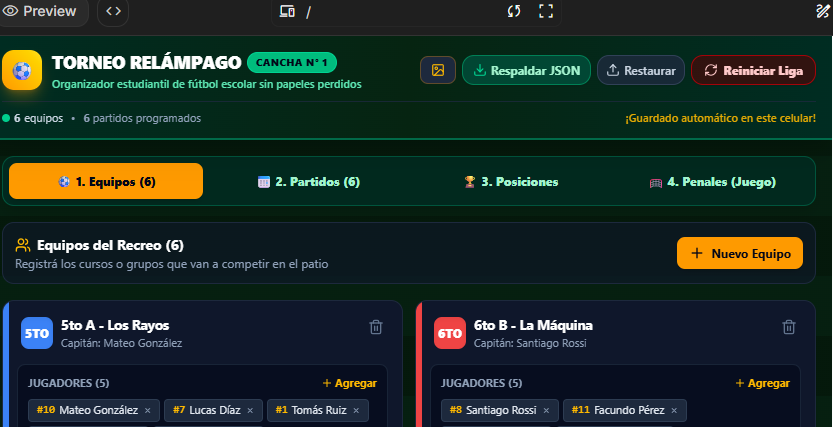

# Prompt 2: Persistencia de Datos (`localStorage`), Respaldo JSON, Reinicio de Liga y Penales

Esta carpeta contiene la evidencia y documentación correspondiente al **Prompt 2** de **Torneo Relámpago**.

---

## 📸 Capturas de Pantalla - Prompt 2

---

## 📋 Cambios Implementados en el Prompt 2

1. **Dónde queda guardada la información exactamente:**
   - En el almacenamiento local del navegador (`localStorage`) dentro de la memoria interna del dispositivo bajo las claves `torneo_relampago_teams_v1` y `torneo_relampago_matches_v1`.
   - No se pierde al cerrar la pestaña, cerrar el navegador ni reiniciar el teléfono.

2. **Qué pasa si el usuario borra el caché o cambia de dispositivo:**
   - El caché normal de imágenes no borra `localStorage`, pero si el usuario borra los *"Datos de sitios web"* o cambia de teléfono/computadora, los datos locales no se transfieren solos.
   - Para solucionarlo, se implementó el sistema de **Exportar Respaldo JSON** y **Restaurar**.

3. **Exportación e Importación de Respaldos JSON:**
   - Botón **`📥 Respaldar`** en el encabezado que descarga un archivo `torneo_relampago_respaldo_AAAA-MM-DD.json`.
   - Botón **`Restaurar`** que permite cargar el archivo `.json` en cualquier dispositivo.

4. **Funciones Adicionales del Torneo:**
   - **Botón Reiniciar Liga:** Limpia la temporada actual con confirmación previa y registra el evento en `HISTORIAL_LIGA.log`.
   - **Modo Revancha:** Permite repetir todos los partidos poniendo los marcadores en cero sin borrar los equipos.
   - **Minijuego de Tanda de Penales:** Cinco direcciones de disparo, arquero móvil y definición por muerte súbita.
