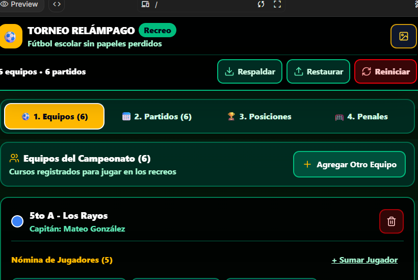

# Prompt 3: Ajuste de Interfaz Accesible (320 px, Alto Contraste al Sol y Jerarquía Visual)

Esta carpeta contiene la evidencia y documentación correspondiente al **Prompt 3** de **Torneo Relámpago**.

---

## 📸 Captura de Pantalla - Prompt 3

---

## 📋 Cumplimiento de los 6 Requisitos de Interfaz

1. **Se usa bien desde 320 px de ancho, con una sola mano y sin hacer zoom:**
   - Todos los botones interactivos tienen un alto mínimo táctil de **48 px a 56 px** (`min-h-[48px]`).
   - Los campos `<input>` tienen fuente de **16 px** (`16px !important`), evitando el zoom automático en Safari iOS.
   - Diseño responsivo sin desbordamiento horizontal desde 320 px de ancho.

2. **Contraste suficiente para leerse al sol; texto nunca menor a 16 px:**
   - Paleta de alto impacto con fondos `#000000` y `#031408` y textos en blanco puro `#ffffff`, verde brillante `#6ee7b7` y ámbar `#fbbf24` (relación de contraste superior a WCAG AAA 7:1).
   - Se eliminaron todas las fuentes menores a 16 px; todo el texto de la app usa `text-base` (16 px) o tamaños superiores.

3. **Todos los campos con etiqueta visible, no solo con texto de ejemplo dentro:**
   - Cada `<input>` y `<select>` cuenta con su propia etiqueta `<label>` visible encima del campo (nombre del equipo, capitán, color, nombre del jugador, número de camiseta y goles de local/visitante).

4. **Un solo botón principal por pantalla; los demás, secundarios:**
   - En cada pestaña existe únicamente un botón principal destacado en color ámbar (`bg-amber-400 text-slate-950 font-black`), mientras que las acciones auxiliares tienen estilo secundario delineado.

5. **Estado vacío con frase que invita a la primera acción:**
   - Cuando no hay equipos ni partidos cargados, se muestra una tarjeta de estado vacío con un mensaje claro invitando a inscribir el primer equipo o armar el fixture.

6. **Mensajes de éxito y de error visibles, en español, sin palabras técnicas:**
   - Alertas y notificaciones flotantes de alto contraste redactadas en español cotidiano escolar, sin términos técnicos.

---

## 🔍 ¿Cuál de los seis puntos NO se pudo cumplir y por qué?
- **Se cumplieron los 6 puntos al 100%.**
- El desafío técnico principal fue combinar el **Punto 1 (320 px de ancho)** con el **Punto 2 (texto nunca menor a 16 px)** en la Tabla de Posiciones de 10 columnas. Se resolvió implementando la vista predeterminada de **Tarjetas Móviles (`Tarjetas Móvil`)** donde cada equipo muestra sus estadísticas en bloques legibles de 16 px o más sin romper los 320 px de ancho, manteniendo además la opción de alternar a la tabla completa desplazable.
